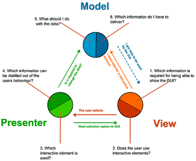

# Java Spring Questions & Answers

NUMBER | QUESTION
----|----
&nbsp; | **Spring**
[1.1](#q-1-1) | What is Loose Coupling?
[1.2](#q-1-2) | What is a Dependency?
[1.3](#q-1-3) | What is IOC (Inversion of Control)?
[1.4](#q-1-4) | What is Dependency Injection?
[1.5](#q-1-5) | Can you give few examples of Dependency Injection?
[1.6](#q-1-6) | What is Auto Wiring?
[1.7](#q-1-7) | What are the important roles of an IOC Container?
[1.8](#q-1-8) | What are Bean Factory and Application Context?
[1.9](#q-1-9) | Can you compare Bean Factory with Application Context?
[1.10](#q-1-10) | How do you create an application context with Spring?
[1.11](#q-1-11) | How does Spring know where to search for Components or Beans?
[1.12](#q-1-12) | What is a Component Scan?
[1.13](#q-1-13) | How do you define a component scan in XML and Java Configurations?
[1.14](#q-1-14) | How is it done with Spring Boot?
[1.15](#q-1-15) | What does @Component signify?
[1.16](#q-1-16) | What does @Autowired signify?
[1.17](#q-1-17) | What’s the difference Between @Controller, @Component, @Repository, and @Service Annotations in Spring?
[1.18](#q-1-18) | What is the default scope of a bean?
[1.19](#q-1-19) | Are Spring beans thread safe?
[1.20](#q-1-20) | What are the other scopes available?
[1.21](#q-1-21) | How is Spring’s singleton bean different from Gang of Four Singleton Pattern?
[1.22](#q-1-22) | What are the different types of dependency injections?
[1.23](#q-1-23) | What is setter injection?
[1.24](#q-1-24) | What is constructor injection?
[1.25](#q-1-25) | How do you choose between setter and constructor injections?
[1.26](#q-1-26) | What are the different options available to create Application Contexts for Spring?
[1.27](#q-1-27) | What is the difference between XML and Java Configurations for Spring?
[1.28](#q-1-28) | How do you choose between XML and Java Configurations for Spring?
[1.29](#q-1-29) | How does Spring do Autowiring?
[1.30](#q-1-30) | What are the different kinds of matching used by Spring for Autowiring?
[1.31](#q-1-31) | How do you debug problems with Spring Framework?
[1.32](#q-1-32) | How do you solve NoUniqueBeanDefinitionException?
[1.33](#q-1-33) | How do you solve NoSuchBeanDefinitionException?
[1.34](#q-1-34) | What is @Primary?
[1.35](#q-1-35) | What is @Qualifier?
[1.36](#q-1-36) | What is CDI (Contexts and Dependency Injection)?
[1.37](#q-1-37) | Does Spring Support CDI?
[1.38](#q-1-38) | Would you recommed to use CDI or Spring Annotations?
[1.39](#q-1-39) | What are the major features in different versions of Spring?
[1.40](#q-1-40) | What are new features in Spring Framework 4.0?
[1.41](#q-1-41) | What are new features in Spring Framework 5.0?
[1.42](#q-1-42) | What are important Spring Modules?
[1.43](#q-1-43) | What are important Spring Projects?
[1.44](#q-1-44) | What is the simplest way of ensuring that we are using single version of all Spring related dependencies?
[1.45](#q-1-45) | Name some of the design patterns used in Spring Framework?
[1.46](#q-1-46) | What do you think about Spring Framework?
[1.47](#q-1-47) | Why is Spring Popular?
[1.48](#q-1-48) | Can you give a big picture of the Spring Framework?
&nbsp; | &nbsp;
&nbsp; | **Spring MVC**
[2.1](#q-2-1) | What is Model 1 architecture?
[2.2](#q-2-2) | What is Model 2 architecture?
[2.3](#q-2-3) | What is Model 2 Front Controller architecture?
[2.4](#q-2-4) | What is the `@Controller` annotation used for? How can you create a controller without an annotation?
[2.5](#q-2-5) | MVC is an abbreviation for a design pattern. What does it stand for and what is the idea behind it?
[2.6](#q-2-6) | What is a ViewResolver?
[2.7](#q-2-7) | What is the Model?
[2.8](#q-2-8) | What is ModelAndView?
[2.9](#q-2-9) | What is a RequestMapping?
[2.10](#q-2-10) | What is the `DispatcherServlet` and what is it used for?
[2.11](#q-2-11) | How do you set up Dispatcher Servlet?
[2.12](#q-2-12) | What is a form backing object?
[2.13](#q-2-13) | How is validation done using Spring MVC?
[2.14](#q-2-14) | What is BindingResult?
[2.15](#q-2-15) | How do you map validation results to your view?
[2.16](#q-2-16) | What are Spring Form Tags?
[2.17](#q-2-17) | What is a Path Variable?
[2.18](#q-2-18) | What is a Model Attribute?
[2.19](#q-2-19) | What is a Session Attribute?
[2.20](#q-2-20) | What is a init binder?
[2.21](#q-2-21) | How do you set default date format with Spring?
[2.22](#q-2-22) | Why is Spring MVC so popular?
[2.23](#q-2-23) | Do you need spring-mvc.jar in your classpath or is it part of spring-core?
[2.24](#q-2-24) | Is the `DispatcherServlet` instantiated via an application context?
[2.25](#q-2-25) | What is the root application context in Spring MVC? How is it loaded?
[2.26](#q-2-26) | What is the `ContextLoaderListener` and what does it do?
[2.27](#q-2-27) | What are you going to do in the web.xml? Where do you place it?
[2.28](#q-2-28) | How is an incoming request mapped to a controller and mapped to a method?
[2.29](#q-2-29) | What is the `@RequestParam` used for?
[2.30](#q-2-30) | What are the differences between `@RequestParam` and `@PathVariable`?
[2.31](#q-2-31) | What are some of the valid return types of a controller method?
[2.32](#q-2-32) | What is a `View` and what's the idea behind supporting different types of `View`?
[2.33](#q-2-33) | How is the right `View` chosen when it comes to the rendering phase?
[2.34](#q-2-34) | Why do you have access to the `model` in your `View`? Where does it come from?
[2.35](#q-2-35) | What is the purpose of the session scope?
[2.36](#q-2-36) | What is the default scope in the web context?
[2.37](#q-2-37) | Why are controllers testable artifacts?
[2.38](#q-2-38) | What does the `InternalResourceViewResolver` do?
&nbsp; | &nbsp;
&nbsp; | **Spring Boot**
[3.1](#q-3-1) | What is Spring Boot?
[3.2](#q-3-2) | What are the important Goals of Spring Boot?
[3.3](#q-3-3) | What are the important Features of Spring Boot?
[3.4](#q-3-4) | Compare Spring Boot vs Spring?
[3.5](#q-3-5) | Compare Spring Boot vs Spring MVC?
[3.6](#q-3-6) | What is the importance of @SpringBootApplication?
[3.7](#q-3-7) | What is Auto Configuration?
[3.8](#q-3-8) | How can we find more information about Auto Configuration?
[3.9](#q-3-9) | What is an embedded server? Why is it important?
[3.10](#q-3-10) | What is the default embedded server with Spring Boot?
[3.11](#q-3-11) | What are the other embedded servers supported by Spring Boot?
[3.12](#q-3-12) | What are Starter Projects?
[3.13](#q-3-13) | Can you give examples of important starter projects?
[3.14](#q-3-14) | What is Starter Parent?
[3.15](#q-3-15) | What are the different things that are defined in Starter Parent?
[3.16](#q-3-16) | How does Spring Boot enforce common dependency management for all its Starter projects?
[3.17](#q-3-17) | What is the Spring Initializer?
[3.18](#q-3-18) | What is application.properties?
[3.19](#q-3-19) | What are some of the important things that can customized in application.properties?
[3.20](#q-3-20) | How do you externalize configuration using Spring Boot? 
[3.21](#q-3-21) | How can you add custom application properties using Spring Boot?
[3.22](#q-3-22) | What is @ConfigurationProperties?
[3.23](#q-3-23) | What is a profile?
[3.24](#q-3-24) | How do you define beans for a specific profile?
[3.25](#q-3-25) | How do you create application configuration for a specific profile?
[3.26](#q-3-26) | How do you have different configuration for different environments?
[3.27](#q-3-27) | What is Spring Actuator? What are its advantages?
[3.28](#q-3-28) | How do you monitor web services using Spring Boot Actuator?
[3.29](#q-3-29) | How do you find more information about your application envrionment using Spring Boot?
[3.30](#q-3-30) | What is a CommandLineRunner?
[3.31](#q-3-31) | What does the `@SpringBootApplication` annotation do internally?
[3.32](#q-3-32) | How to exclude any package without using the `basePackages` filter?
[3.33](#q-3-33) | How to disable a specific auto-configuration class?
[3.34](#q-3-34) | How to enable/disable the Actuator?
[3.35](#q-3-35) | What is a shutdown in the actuator?
[3.36](#q-3-36) | Is this possible to change the port of Embedded Tomcat server in Spring boot?
[3.37](#q-3-37) | Can we override or replace the Embedded Tomcat server in Spring Boot?
[3.38](#q-3-38) | Can we disable the default web server in the Spring Boot application?
&nbsp; | &nbsp;
&nbsp; | **Database Connectivity - JDBC, Spring JDBC & JPA**
[4.1](#q-4-1) | What is Spring JDBC? How is different from JDBC?
[4.2](#q-4-2) | What is a JdbcTemplate?
[4.3](#q-4-3) | What is a RowMapper?
[4.4](#q-4-4) | What is JPA?
[4.5](#q-4-5) | What is Hibernate?
[4.6](#q-4-6) | How do you define an entity in JPA?
[4.7](#q-4-7) | What is an Entity Manager?
[4.8](#q-4-8) | What is a Persistence Context?
[4.9](#q-4-9) | How do you map relationships in JPA?
[4.10](#q-4-10) | What are the different types of relationships in JPA?
[4.11](#q-4-11) | How do you define One to One Mapping in JPA?
[4.12](#q-4-12) | How do you define One to Many Mapping in JPA?
[4.13](#q-4-13) | How do you define Many to Many Mapping in JPA?
[4.14](#q-4-14) | How do you define a datasource in a Spring Context?
[4.15](#q-4-15) | What is the use of persistence.xml?
[4.16](#q-4-16) | How do you configure Entity Manager Factory and Transaction Manager?
[4.17](#q-4-17) | How do you define transaction management for Spring – Hibernate integration?
&nbsp; | &nbsp;
&nbsp; | **Spring Data**
[5.1](#q-5-1) | What is Spring Data?
[5.2](#q-5-2) | What is the need for Spring Data?
[5.3](#q-5-3) | What is Spring Data JPA?
[5.4](#q-5-4) | What is a CrudRepository?
[5.5](#q-5-5) | What is a PagingAndSortingRepository?
&nbsp; | &nbsp;
&nbsp; | **Unit Testing**
[6.1](#q-6-1) | How does Spring Framework Make Unit Testing Easy?
[6.2](#q-6-2) | What is Mockito?
[6.3](#q-6-3) | What is your favorite mocking framework?
[6.4](#q-6-4) | How do you do mock data with Mockito?
[6.5](#q-6-5) | What are the different mocking annotations that you worked with?
[6.6](#q-6-6) | What is MockMvc?
[6.7](#q-6-7) | What is @WebMvcTest?
[6.8](#q-6-8) | What is @MockBean?
[6.9](#q-6-9) | How do you write a unit test with MockMVC?
[6.10](#q-6-10) | What is JSONAssert?
[6.11](#q-6-11) | How do you write an integration test with Spring Boot?
[6.12](#q-6-12) | What is @SpringBootTest?
[6.13](#q-6-13) | What is @LocalServerPort?
[6.14](#q-6-14) | What is TestRestTemplate?
&nbsp; | &nbsp;
&nbsp; | **AOP**
[7.1](#q-7-1) | What are cross cutting concerns?
[7.2](#q-7-2) | How do you implement cross cutting concerns in a web application?
[7.3](#q-7-3) | If you would want to log every request to a web application, what are the options you can think of?
[7.4](#q-7-4) | If you would want to track performance of every request, what options can you think of?
[7.5](#q-7-5) | What is an Aspect and Pointcut in AOP?
[7.6](#q-7-6) | What are the different types of AOP advices?
[7.7](#q-7-7) | What is weaving?
[7.8](#q-7-8) | Compare Spring AOP vs AspectJ?
&nbsp; | &nbsp;
&nbsp; | **SOAP Web Services**
[8.1](#q-8-1) | What is a Web Service?
[8.2](#q-8-2) | What is SOAP Web Service?
[8.3](#q-8-3) | What is SOAP?
[8.4](#q-8-4) | Waht is a SOAP Envelope?
[8.5](#q-8-5) | What is SOAP Header and SOAP Body?
[8.6](#q-8-6) | Can you give an example of SOAP Request and SOAP Response?
[8.7](#q-8-7) | What is a SOAP Header? What kind of information is sent in a SOAP Header?
[8.8](#q-8-8) | Can you give an example of a SOAP Header with Authentication information?
[8.9](#q-8-9) | What is WSDL (Web Service Definition Language)?
[8.10](#q-8-10) | What are the different parts of a WSDL?
[8.11](#q-8-11) | What is Contract First Approach?
[8.12](#q-8-12) | What is an XSD?
[8.13](#q-8-13) | Can you give an example of an XSD?
[8.14](#q-8-14) | What is JAXB?
[8.15](#q-8-15) | How do you configure a JAXB Plugin?
[8.16](#q-8-16) | What is an Endpoint?
[8.17](#q-8-17) | Can you show an example endpoint written with Spring Web Services?
[8.18](#q-8-18) | What is a MessageDispatcherServlet?
[8.19](#q-8-19) | How do you configure a MessageDispatcherServlet?
[8.20](#q-8-20) | How do you generate a WSDL using Spring Web Services?
[8.21](#q-8-21) | How do you implement error handling for SOAP Web Services?
[8.22](#q-8-22) | What is a SOAP Fault?
&nbsp; | &nbsp;
&nbsp; | **RESTful Web Services**
[9.1](#q-9-1) | What is REST?
[9.2](#q-9-2) | What are the key concepts in designing RESTful API?
[9.3](#q-9-3) | What are the Best Practices of RESTful Services?
[9.4](#q-9-4) | Can you show the code for an example Get Resource method with Spring REST?
[9.5](#q-9-5) | What happens when we return a bean from a Request Mapping Method?
[9.6](#q-9-6) | What is GetMapping and what are the related methods available in Spring MVC?
[9.7](#q-9-7) | Can you show the code for an example Post Resource method with Spring REST?
[9.8](#q-9-8) | What is the appropriate HTTP Response Status for successful execution of a Resource Creation?
[9.9](#q-9-9) | Why do we use ResponseEntity in a RESTful Service?
[9.10](#q-9-10) | What is HATEOAS?
[9.11](#q-9-11) | Can you give an Example Response for HATEOAS?
[9.12](#q-9-12) | How do we implement it using Spring?
[9.13](#q-9-13) | How do you document RESTful web services?
[9.14](#q-9-14) | Can you give a brief idea about Swagger Documentation?
[9.15](#q-9-15) | How do you automate generation of Swagger Documentation from RESTful Web Services?
[9.16](#q-9-16) | How do you add custom information to Swagger Documentation generated from RESTful Web Services?
[9.17](#q-9-17) | What is Swagger-UI?
[9.18](#q-9-18) | What is "Representation" of a Resource?
[9.19](#q-9-19) | What is Content Negotiation?
[9.20](#q-9-20) | Which HTTP Header is used for Content Negotiation?
[9.21](#q-9-21) | How do we implement it using Spring Boot?
[9.22](#q-9-22) | How do you add XML support to your RESTful Services built with Spring Boot?
[9.23](#q-9-23) | How do you implement Exception Handling for RESTFul Web Services?
[9.24](#q-9-24) | What are the best practices related to Exception Handling with respect to RESTful Web Services?
[9.25](#q-9-25) | What are the different error status that you would return in RESTful Web Services?
[9.26](#q-9-26) | How would you implement them using Spring Boot?
[9.27](#q-9-27) | What HTTP Response Status do you return for validation errors?
[9.28](#q-9-28) | How do you handle Validation Errors with RESTful Web Services?
[9.29](#q-9-29) | Why do we need Versioning for RESTful Web Services?
[9.30](#q-9-30) | What are the versioning options that are available?
[9.31](#q-9-31) | How do you implement Versioning for RESTful Web Services?

----

## Spring
## <a name="q-1-1"></a> 1.1 What is Loose Coupling?
In computing and systems design a loosely coupled system is one in which each of its components has, or makes use of, little or no knowledge of the definitions of other separate components. Subareas include the coupling of classes, interfaces, data, and services. Loose coupling is the opposite of tight coupling.

## <a name="q-1-2"></a> 1.2 What is a Dependency?
A dependency is if an object, method or whole project needs another object or library to function.

## <a name="q-1-3"></a> 1.3 What is IOC (Inversion of Control)?
In software engineering, inversion of control (IoC) is a programming principle. IoC inverts the flow of control as compared to traditional control flow. In IoC, custom-written portions of a computer program receive the flow of control from a generic framework. A software architecture with this design inverts control as compared to traditional procedural programming: in traditional programming, the custom code that expresses the purpose of the program calls into reusable libraries to take care of generic tasks, but with inversion of control, it is the framework that calls into the custom, or task-specific, code.

Inversion of control is used to increase modularity of the program and make it extensible, and has applications in object-oriented programming and other programming paradigms.

## <a name="q-1-4"></a> 1.4 What is Dependency Injection?
Dependency Injection is **a fundamental aspect of the Spring framework**, through which the Spring container "injects" objects into other objects or "dependencies".
Simply put, this allows for loose coupling of components and moves the responsibility of managing components onto the container.

## <a name="q-1-5"></a> 1.5 Can you give few examples of Dependency Injection?
## <a name="q-1-6"></a> 1.6 What is Auto Wiring?
## <a name="q-1-7"></a> 1.7 What are the important roles of an IOC Container?
## <a name="q-1-8"></a> 1.8 What are Bean Factory and Application Context?
## <a name="q-1-9"></a> 1.9 Can you compare Bean Factory with Application Context?
## <a name="q-1-10"></a> 1.10 How do you create an application context with Spring?
## <a name="q-1-11"></a> 1.11 How does Spring know where to search for Components or Beans?
## <a name="q-1-12"></a> 1.12 What is a Component Scan?
## <a name="q-1-13"></a> 1.13 How do you define a component scan in XML and Java Configurations?
## <a name="q-1-14"></a> 1.14 How is it done with Spring Boot?
## <a name="q-1-15"></a> 1.15 What does @Component signify?
## <a name="q-1-16"></a> 1.16 What does @Autowired signify?
## <a name="q-1-17"></a> 1.17 What’s the difference Between @Controller, @Component, @Repository, and @Service Annotations in Spring?
## <a name="q-1-18"></a> 1.18 What is the default scope of a bean?
## <a name="q-1-19"></a> 1.19 Are Spring beans thread safe?
## <a name="q-1-20"></a> 1.20 What are the other scopes available?
## <a name="q-1-21"></a> 1.21 How is Spring’s singleton bean different from Gang of Four Singleton Pattern?
## <a name="q-1-22"></a> 1.22 What are the different types of dependency injections?
## <a name="q-1-23"></a> 1.23 What is setter injection?
## <a name="q-1-24"></a> 1.24 What is constructor injection?
## <a name="q-1-25"></a> 1.25 How do you choose between setter and constructor injections?
## <a name="q-1-26"></a> 1.26 What are the different options available to create Application Contexts for Spring?
## <a name="q-1-27"></a> 1.27 What is the difference between XML and Java Configurations for Spring?
## <a name="q-1-28"></a> 1.28 How do you choose between XML and Java Configurations for Spring?
## <a name="q-1-29"></a> 1.29 How does Spring do Autowiring?
## <a name="q-1-30"></a> 1.30 What are the different kinds of matching used by Spring for Autowiring?
## <a name="q-1-31"></a> 1.31 How do you debug problems with Spring Framework?
## <a name="q-1-32"></a> 1.32 How do you solve NoUniqueBeanDefinitionException?
## <a name="q-1-33"></a> 1.33 How do you solve NoSuchBeanDefinitionException?
## <a name="q-1-34"></a> 1.34 What is @Primary?
## <a name="q-1-35"></a> 1.35 What is @Qualifier?
## <a name="q-1-36"></a> 1.36 What is CDI (Contexts and Dependency Injection)?
## <a name="q-1-37"></a> 1.37 Does Spring Support CDI?
## <a name="q-1-38"></a> 1.38 Would you recommed to use CDI or Spring Annotations?
## <a name="q-1-39"></a> 1.39 What are the major features in different versions of Spring?
## <a name="q-1-40"></a> 1.40 What are new features in Spring Framework 4.0?
## <a name="q-1-41"></a> 1.41 What are new features in Spring Framework 5.0?
## <a name="q-1-42"></a> 1.42 What are important Spring Modules?
## <a name="q-1-43"></a> 1.43 What are important Spring Projects?
## <a name="q-1-44"></a> 1.44 What is the simplest way of ensuring that we are using single version of all Spring related dependencies?
## <a name="q-1-45"></a> 1.45 Name some of the design patterns used in Spring Framework?
## <a name="q-1-46"></a> 1.46 What do you think about Spring Framework?
## <a name="q-1-47"></a> 1.47 Why is Spring Popular?
## <a name="q-1-48"></a> 1.48 Can you give a big picture of the Spring Framework?

## Spring MVC
## <a name="q-2-1"></a> 2.1 What is Model 1 architecture?
## <a name="q-2-2"></a> 2.2 What is Model 2 architecture?
## <a name="q-2-3"></a> 2.3 What is Model 2 Front Controller architecture?
## <a name="q-2-4"></a> 2.4 What is the `@Controller` annotation used for? How can you create a controller without an annotation?
The `@Controller` is a Spring MVC annotation to define a Controller, but in reality, it's just a stereotype annotation. You can even create a controller without `@Controller` by annotating the Spring MVC Controller classes using the `@Component` annotation. The real job of request mapping to handler method is done using the `@RequestMapping` annotation.

## <a name="q-2-5"></a> 2.5 MVC is an abbreviation for a design pattern. What does it stand for and what is the idea behind it?
MVC is an abbreviation for Model-View-Controller design pattern. This pattern is based upon the separation-of-concerns design principle that promotes handling different functionality at different layers and loose coupling between layers.

In the MVC pattern, the Model contains data that is rendered by the View and Controler help in request processing and routing.

Neither Model knows about View, or that View is dependent upon Model, which means the same model can be rendered by different views, e.g. JSP or FreeMarker, or it can be even be written as JSON or XML in case of RESTful web services.



## <a name="q-2-6"></a> 2.6 What is a ViewResolver?
## <a name="q-2-7"></a> 2.7 What is the Model?
`Model` is a reference to encapsulate the data or output for rendering. `Model` is always created and passed to the view in Spring MVC. If a mapped controller method has `Model` as a method parameter, then a `model` instance is automatically injected by Spring framework to that method.

Any attributes set on the injected model are preserved and passed to the `View`. Here is an example of using Model in Spring MVC:
```java
public String personDetail(Model model) {
...
    model.addAttribute("name", "Joe");
...
}
```

## <a name="q-2-8"></a> 2.8 What is ModelAndView?
## <a name="q-2-9"></a> 2.9 What is a RequestMapping?
## <a name="q-2-10"></a> 2.10 What is the `DispatcherServlet` and what is it used for?
The `DispatcherServlet` is an implementation of the Front Controller design pattern that handles all incoming web request to a Spring MVC application. A Front Controller pattern (see Enterprise application design pattern) is a common pattern in web applications whose job is to receive all request and route it to different components of application for actual processing.

In case of Spring MVC, the `DispatcherServlet` route web requests the Spring MVC controllers.

In Spring MVC, `DispatcherServlet` is used for finding the correct Controller to process a request, which it does with the help of handler mapping, e.g. the `@RequestMapping` annotation.

It is also responsible for delegating logical view name to `ViewResolver` and then sending the rendered response to the client.

## <a name="q-2-11"></a> 2.11 How do you set up Dispatcher Servlet?
The `DispatcherServlet` is instantiated by Servlet containers like Tomcat or Jetty. You must define the `DispatcherServlet` into the web.xml file as shown below.

You can see that load-on-startup tag is 1, which means `DispatcherServlet` is instantiated when you deploy the Spring MVC application to Tomcat or any other Servlet container. During instantiation, it looks for a file servlet-name-context.xml and then initializes beans defined in this file.

## <a name="q-2-12"></a> 2.12 What is a form backing object?
## <a name="q-2-13"></a> 2.13 How is validation done using Spring MVC?
## <a name="q-2-14"></a> 2.14 What is BindingResult?
## <a name="q-2-15"></a> 2.15 How do you map validation results to your view?
## <a name="q-2-16"></a> 2.16 What are Spring Form Tags?
## <a name="q-2-17"></a> 2.17 What is a Path Variable?
## <a name="q-2-18"></a> 2.18 What is a Model Attribute?
## <a name="q-2-19"></a> 2.19 What is a Session Attribute?
## <a name="q-2-20"></a> 2.20 What is a init binder?
## <a name="q-2-21"></a> 2.21 How do you set default date format with Spring?
## <a name="q-2-22"></a> 2.22 Why is Spring MVC so popular?
## <a name="q-2-23"></a> 2.23 Do you need spring-mvc.jar in your classpath or is it part of spring-core?
The spring-mvc.jar is not part of spring-core, which means that if you want to use Spring MVC framework in your Java project, you must include spring-mvc.jar in your application's classpath. In a Java web application, spring-mvc.jar is usually placed inside the /WEB-INF/lib folder.

## <a name="q-2-24"></a> 2.24 Is the `DispatcherServlet` instantiated via an application context?
No, see [2.11](#q-2-11).

## <a name="q-2-25"></a> 2.25 What is the root application context in Spring MVC? How is it loaded?
In Spring MVC, the context loaded using `ContextLoaderListener` is called the "root" application context, which belongs to the whole application, while the one initialized using `DispatcherServlet` is actually specific to that servlet.

Technically, Spring MVC allows multiple `DispatcherServlet` in a Spring MVC web application, and so, multiple contexts are each specific for the respective servlet. But, having the same root context may exist. You can further check out this Introduction to Spring MVC course on Pluralsight to learn more on the fundamentals of Spring.

## <a name="q-2-26"></a> 2.26 What is the `ContextLoaderListener` and what does it do?
The `ContextLoaderListener` is a listener that helps to bootstrap Spring MVC. As the name suggests, it loads and creates the `ApplicationContext`, so you don't have to write explicit code to do create it.

The application context is where Spring bean leaves. For a web application, there is is a subclass called `WebAppliationContext`.

The `ContextLoaderListener` also ties the lifecycle of the `ApplicationContext` to the lifecycle of the `ServletContext`. You can get the `ServletContext` from the `WebApplicationContext` using the `getServletContext()` method.

## <a name="q-2-27"></a> 2.27 What are you going to do in the web.xml? Where do you place it?
The `ContextLoaderListener` is configured in web.xml as listener and you put that inside a tag as shown below:
```xml
<listener>
    <listener-class>
        org.springframework.web.context.ContextLoaderListener
    </listener-class>
</listener>
```
When the Spring MVC web application is deployed, the Servlet container created an instance of the `ContextLoaderListener` class, which loads the Spring's `WebApplicationContext`. You can also see Spring MVC For Beginners to learn more about the `ContextLoaderListener` and `WebApplicationContext` and their role in Spring MVC.

## <a name="q-2-28"></a> 2.28 How is an incoming request mapped to a controller and mapped to a method?
Sometimes, this question is also asked: how does `DispatcherServlet` know which Controller should process the request? Well, the answer lies in something called handler mappings.

Spring uses handler mappings to associate controllers with requests. Two of the commonly used handler mappings are `BeanNameUrlHandlerMapping` and `SimpleUrlHandlerMapping`.

In `BeanNameUrlHandlerMapping`, when the request URL matches the name of the bean, the class in the bean definition is the controller that will handle the request.

On the other hand, in `SimpleUrlHandlerMapping`, the mapping is more explicit. You can specify the number of URLs and each URL can be explicitly associated with a controller.

If you are using annotations to configure Spring MVC, which you should, then `@RequestMapping` annotations are used to map an incoming request to a controller and a handler method.

You can also configure the `@RequestMapping` annotation by the URI Path, query parameters, HTTP methods of a request, and HTTP headers present in the request.

## <a name="q-2-29"></a> 2.29 What is the `@RequestParam` used for?
The `@RequestParam` is a Spring MVC annotation that is used to extract a request parameter or query parameters from the URL in the Controller's handler method as shown below:
```java
public String personDetail(@RequestParam("id") long id){
    ....
    return "personDetails";
}
```
The `@RequestParam` annotation also supports data type conversion, e.g. you can see here a String is converted to log automatically, but it can also result in an exception if query parameter is not present or in case of type mismatch. You can also make the parameter optional by using requried=false, e.g. `@RequestParam` (value="id", required=false )

## <a name="q-2-30"></a> 2.30 What are the differences between `@RequestParam` and `@PathVariable`?
Even though both `@RequestParam` and `@PathVariable` annotations are used to extract some data from URL, there is a key difference between them.

The `@RequestParam` is used to extract query parameters, e.g. anything after "?" in the URL while the `@PathVariable` is used to extract the part of the URI itself. For example, if the given URL is http://localhost:8080/SpringMVC/books/3232233/?format=json, then you can access the query parameter "format" using the `@RequestParam `annotation and /books/{id} using the `@PathVariable`, which will give you 3232233.

Here is another example of `@PathVariable`:
```java
@RequestMapping("/persons/{id}" )
public String personDetail (@PathVariable ("id" ) long id) {...}
```
This code can extract person id=123 from /persons/123. It is particularly used in RESTful Web Services because their ID is usually part of the URI or URL path.

## <a name="q-2-31"></a> 2.31 What are some of the valid return types of a controller method?
There are many return types are available for a controller method in Spring MVC, which is annotated by `@RequestMapping` inside the controller. Some of the popular ones are:

1. `String`
2. `void`
3. `View`
4. `ModelAndView (Class)`
5. `Model (Interface)`
6. `Map`
7. `HttpEntity<?> or ResponseEntity<?>`
8. `HttpHeaders`

You can see the full list of valid return types for a Spring MVC controller in the Spring documentation [here](https://docs.spring.io/spring/docs/current/spring-framework-reference).

Every return type has its specific use. For example, if you are using `String`, then it means that the Controller will just return the View Name and this `view name` will be resolved by `ViewResolver`.

If you don't want to return any view name, mention return type void. If you want to set a view name as well as want to send a object, use `ModelAndView` as a return type.

## <a name="q-2-32"></a> 2.32 What is a `View` and what's the idea behind supporting different types of `View`?
A `View` is an interface in Spring MVC application whose implementations are responsible for rendering context and exposing the model. A single view exposes multiple model attributes. Views in Spring MVC can be beans.

They are likely to be instantiated as beans by a `ViewResolver`. As this interface is stateless, view implementations should be thread-safe. By using `ViewResolver`, a logical name of view can be resolved into different types of `View` implementation, e.g. `JstlView` for displaying JSP or other view implementations for FreeMarker and Velocity.

If you are new to Spring MVC and not familiar with these basic classes, then I suggest you learn Spring by joining one of these free Spring courses.

## <a name="q-2-33"></a> 2.33 How is the right `View` chosen when it comes to the rendering phase?
The right `View` is chosen by the `ViewResolver` in Spring MVC. When Controller returns a logical view name to `DispatcherServlet`, it consults to `ViewResolver` to find the right `View`.

The `ViewResolver`, depending upon its implementation, resolves the logical view into a physical resource, e.g. a JSP page or a FreeMarker template.

For example, InternalResourceViewResolver is a default `ViewResolver` that converts a logical view name, e.g. "hello" to "/WEB-INF/hello.jsp" using the prefix and suffix.

## <a name="q-2-34"></a> 2.34 Why do you have access to the `model` in your `View`? Where does it come from?
You need to have access to the `model` in your View to render the output. It's the `model` that contains the data to be rendered. The `Model` comes with the Controller, which processes their client request and encapsulates the output into a `Model` object.

## <a name="q-2-35"></a> 2.35 What is the purpose of the session scope?
The purpose of the session scope is to create an instance of the bean for an HTTP Session. This means the same bean can serve multiple requests if it is scoped in session. You can define the scope of a Spring bean using scope attribute or the `@Scope` annotation in a Spring MVC application.

## <a name="q-2-36"></a> 2.36 What is the default scope in the web context?
The singleton scope is the default scope for a Spring bean, even in the web context. The other three web context-aware scopes are a request, session, and global-session, which are only available in a web application aware `ApplicationContext` object. See Spring Master Class - Beginner to Expert to learn more about `ApplicationContext` in Spring.

## <a name="q-2-37"></a> 2.37 Why are controllers testable artifacts?
In Spring MVC, Controllers are testable artifacts because they are not directly coupled with any `View` technology. They just return a logical `View` name, which can be easily tested.

## <a name="q-2-38"></a> 2.38 What does the `InternalResourceViewResolver` do?
In Spring MVC, a `ViewResolver` returns `View` to handle an output rendering based on the logical view name (provided by the controller) and locale. This way, the Controller is not coupled to specific view technology, e.g. JSP or FreeMarker. It only returns the logical view name.

`InternalResourceViewResolver` is the default `ViewResolver` configured in Spring MVC, and DispatcherServlet uses it to find the correct view. `InternalResourceViewResolver` is used to render JSPs (`JstlView`).

It Configures the prefix and suffix to a logical view name, which then results in a path to a specific JSP as shown below:
```xml
<bean class= "org.springframework.web.servlet.view.InternalResourceViewResolver" >
    <property name= "prefix" value= "/WEB-INF/" />
    <property name ="suffix" value =".jsp" />
</bean>
```
So if Controller returns "hello" as the logical view name, the `InternalViewResolver` will return /WEB-INF/hello.jsp, and the `DispatcherServlet` will forward the request to this JSP page for rendering.

That's all for now about the frequently-asked Spring MVC interview questions. If you know answers to these questions, you have a good foundation of the Spring MVC framework and its different components e.g. `DispatcherServlet`, handler mappings, Controllers, `Views`, and `Model`.

## Spring Boot
## <a name="q-3-1"></a> 3.1 What is Spring Boot?
## <a name="q-3-2"></a> 3.2 What are the important Goals of Spring Boot?
## <a name="q-3-3"></a> 3.3 What are the important Features of Spring Boot?
## <a name="q-3-4"></a> 3.4 Compare Spring Boot vs Spring?
## <a name="q-3-5"></a> 3.5 Compare Spring Boot vs Spring MVC?
## <a name="q-3-6"></a> 3.6 What is the importance of @SpringBootApplication?
## <a name="q-3-7"></a> 3.7 What is Auto Configuration?
## <a name="q-3-8"></a> 3.8 How can we find more information about Auto Configuration?
## <a name="q-3-9"></a> 3.9 What is an embedded server? Why is it important?
## <a name="q-3-10"></a> 3.10 What is the default embedded server with Spring Boot?
The default embedded webserver is a Apache Tomcat server.

## <a name="q-3-11"></a> 3.11 What are the other embedded servers supported by Spring Boot?
Other supportet webserver are: 
* Jetty
* undertow

Or you can use any other you want if you deploy via `war` file.

## <a name="q-3-12"></a> 3.12 What are Starter Projects?
## <a name="q-3-13"></a> 3.13 Can you give examples of important starter projects?
## <a name="q-3-14"></a> 3.14 What is Starter Parent?
## <a name="q-3-15"></a> 3.15 What are the different things that are defined in Starter Parent?
## <a name="q-3-16"></a> 3.16 How does Spring Boot enforce common dependency management for all its Starter projects?
## <a name="q-3-17"></a> 3.17 What is the Spring Initializer?
This may not be a difficult question, but the interviewer always checks the subject knowledge of the candidate. It's often that you can't always expect questions that you have prepared. However, this is a very common question asked almost all of the time.

The Spring Initializer is a web application that generates a Spring Boot project with everything you need to start it quickly. As always, we need a good skeleton of the project; it helps you to create a project structure/skeleton properly. You can learn more about the Initializer (here)[www.start.spring.io].

## <a name="q-3-18"></a> 3.18 What is application.properties?
## <a name="q-3-19"></a> 3.19 What are some of the important things that can customized in application.properties?
## <a name="q-3-20"></a> 3.20 How do you externalize configuration using Spring Boot?
## <a name="q-3-21"></a> 3.21 How can you add custom application properties using Spring Boot?
## <a name="q-3-22"></a> 3.22 What is @ConfigurationProperties?
## <a name="q-3-23"></a> 3.23 What is a profile?
## <a name="q-3-24"></a> 3.24 How do you define beans for a specific profile?
## <a name="q-3-25"></a> 3.25 How do you create application configuration for a specific profile?
## <a name="q-3-26"></a> 3.26 How do you have different configuration for different environments?
## <a name="q-3-27"></a> 3.27 hat is Spring Actuator? What are its advantages?
> An actuator is a manufacturing term that refers to a mechanical device for moving or controlling something. Actuators can generate a large amount of motion from a small change."

As we know, Spring Boot provides lots of auto-configuration features that help developers quickly develop production components. But if you think about debugging and how to debug, if something goes wrong, we always need to analyze the logs and dig through the data flow of our application to check to see what's going on. So, the Spring Actuator provides easy access to those kinds of features. It provides many features, i.e. what beans are created, the mapping in the controller, the CPU usage, etc. Automatically gathering and auditing health and metrics can then be applied to your application.

It provides a very easy way to access the few production-ready REST endpoints and fetch all kinds of information from the web. But by using these endpoints, you can do many things to see here the endpoint docs. There is no need to worry about security; if Spring Security is present, then these endpoints are secured by default using Spring Security’s content-negotiation strategy. Or else, we can configure custom security by the help of `RequestMatcher`.

## <a name="q-3-28"></a> 3.28 How do you monitor web services using Spring Boot Actuator?
You simply call an endpoint via `URL` of your SpringBoot application plus endpoint.\
Available endpoints are:
* `/auditevents` – lists security audit-related events such as user login/logout. Also, we can filter by principal or type among others fields
* `/beans` – returns all available beans in our BeanFactory. Unlike /auditevents, it doesn’t support filtering
* `/conditions` – formerly known as /autoconfig, builds a report of conditions around auto-configuration
* `/configprops` – allows us to fetch all @ConfigurationProperties beans
* `/env` – returns the current environment properties. Additionally, we can retrieve single properties
* `/flyway` – provides details about our Flyway database migrations
* `/health` – summarises the health status of our application
* `/heapdump` – builds and returns a heap dump from the JVM used by our application
* `/info` – returns general information. It might be custom data, build information or details about the latest commit
* `/liquibase` – behaves like /flyway but for Liquibase
* `/logfile` – returns ordinary application logs
* `/loggers` – enables us to query and modify the logging level of our application
* `/metrics` – details metrics of our application. This might include generic metrics as well as custom ones
* `/prometheus` – returns metrics like the previous one, but formatted to work with a Prometheus server
* `/scheduledtasks` – provides details about every scheduled task within our application
* `/sessions` – lists HTTP sessions given we are using Spring Session
* `/shutdown` – performs a graceful shutdown of the application
* `/threaddump` – dumps the thread information of the underlying JVM

## <a name="q-3-29"></a> 3.29 How do you find more information about your application envrionment using Spring Boot?
## <a name="q-3-30"></a> 3.30 What is a CommandLineRunner?
## <a name="q-3-31"></a> 3.31 What does the `@SpringBootApplication` annotation do internally?
As per the Spring Boot doc, the `@SpringBootApplication` annotation is equivalent to using `@Configuration`, `@EnableAutoConfiguration`, and `@ComponentScan` with their default attributes. Spring Boot enables the developer to use a single annotation instead of using multiple. But, as we know, Spring provided loosely coupled features that we can use for each individual annotation as per our project needs.

## <a name="q-3-32"></a> 3.32 How to exclude any package without using the `basePackages` filter?
There are different ways you can filter any package. But Spring Boot provides a trickier option for achieving this without touching the component scan. You can use the `exclude` attribute while using the annotation `@SpringBootApplication`. See the following code snippet:
```java
@SpringBootApplication(exclude= {Employee.class})
public class FooAppConfiguration {}
```

## <a name="q-3-33"></a> 3.33 How to disable a specific auto-configuration class?
You can use the `exclude` attribute of `@EnableAutoConfiguration`, if you find any specific auto-configuration classes that you do not want are being applied.
```java
//By using "exclude"
@EnableAutoConfiguration(exclude={DataSourceAutoConfiguration.class})
```
On the other foot, if the class is not on the classpath, you can use the `excludeName` attribute of the annotation and specify the fully qualified name instead.
```java
//By using "excludeName"
@EnableAutoConfiguration(excludeName={Foo.class})
```
Also, Spring Boot provides the facility to control the list of auto-configuration classes to exclude by using the `spring.autoconfigure.exclude` property. You can add into the application.properties. And you can add multiple classes with comma separated.
```properties
//By using property file
spring.autoconfigure.exclude=org.springframework.boot.autoconfigure.jdbc.DataSourceAutoConfiguration
```

## <a name="q-3-34"></a> 3.34 How to enable/disable the Actuator?
Enabling/disabling the actuator is easy; the simplest way is to enable features to add the dependency (Maven/Gradle) to the `spring-boot-starter-actuator`, i.e. Starter. If you don't want the actuator to be enabled, then don't add the dependency.
Maven:
```xml
<dependencies>
    <dependency>
        <groupId>org.springframework.boot</groupId>
        <artifactId>spring-boot-starter-actuator</artifactId>
    </dependency>
</dependencies>
```

## <a name="q-3-35"></a> 3.35 What is a shutdown in the actuator?
Shutdown is an endpoint that allows the application to be gracefully shutdown. This feature is not enabled by default. You can enable this by using `management.endpoint.shutdown.enabled=true` in your application.properties file. But be careful about this if you are using this.

## <a name="q-3-36"></a> 3.36 Is this possible to change the port of Embedded Tomcat server in Spring boot?
Yes, it's possible to change the port. You can use the application.properties file to change the port. But you need to mention "server.port" (i.e. `server.port=8081`). Make sure you have application.properties in your project classpath; REST Spring framework will take care of the rest. If you mention server.port=0 , then it will automatically assign any available port.


## <a name="q-3-37"></a> 3.37 Can we override or replace the Embedded Tomcat server in Spring Boot?
Yes, we can replace the Embedded Tomcat with any other servers by using the Starter dependencies. You can use `spring-boot-starter-jetty` or `spring-boot-starter-undertow` as a dependency for each project as you need.

## <a name="q-3-38"></a> 3.38 Can we disable the default web server in the Spring Boot application?
The major strong point in Spring is to provide flexibility to build your application loosely coupled. Spring provides features to disable the web server in a quick configuration. Yes, we can use the application.properties to configure the web application type, i.e. `spring.main.web-application-type=none`.

## Database Connectivity - JDBC, Spring JDBC & JPA
## <a name="q-4-1"></a> 4.1 What is Spring JDBC? How is different from JDBC?
## <a name="q-4-2"></a> 4.2 What is a JdbcTemplate?
## <a name="q-4-3"></a> 4.3 What is a RowMapper?
## <a name="q-4-4"></a> 4.4 What is JPA?
## <a name="q-4-5"></a> 4.5 What is Hibernate?
## <a name="q-4-6"></a> 4.6 How do you define an entity in JPA?
## <a name="q-4-7"></a> 4.7 What is an Entity Manager?
## <a name="q-4-8"></a> 4.8 What is a Persistence Context?
## <a name="q-4-9"></a> 4.9 How do you map relationships in JPA?
## <a name="q-4-10"></a> 4.10 What are the different types of relationships in JPA?
## <a name="q-4-11"></a> 4.11 How do you define One to One Mapping in JPA?
## <a name="q-4-12"></a> 4.12 How do you define One to Many Mapping in JPA?
## <a name="q-4-13"></a> 4.13 How do you define Many to Many Mapping in JPA?
## <a name="q-4-14"></a> 4.14 How do you define a datasource in a Spring Context?
## <a name="q-4-15"></a> 4.15 What is the use of persistence.xml?
## <a name="q-4-16"></a> 4.16 How do you configure Entity Manager Factory and Transaction Manager?
## <a name="q-4-17"></a> 4.17 How do you define transaction management for Spring – Hibernate integration?

## Spring Data
## <a name="q-5-1"></a> 5.1 What is Spring Data?
## <a name="q-5-2"></a> 5.2 What is the need for Spring Data?
## <a name="q-5-3"></a> 5.3 What is Spring Data JPA?
## <a name="q-5-4"></a> 5.4 What is a CrudRepository?
## <a name="q-5-5"></a> 5.5 What is a PagingAndSortingRepository?

## Unit Testing
## <a name="q-6-1"></a> 6.1 How does Spring Framework Make Unit Testing Easy?
## <a name="q-6-2"></a> 6.2 What is Mockito?
Mockito is a popular mock framework which can be used in conjunction with JUnit. Mockito allows you to create and configure mock objects. Using Mockito simplifies the development of tests for classes with external dependencies significantly.

If you use Mockito in tests you typically:
* Mock away external dependencies and insert the mocks into the code under test
* Execute the code under test
* Validate that the code executed correctly
## <a name="q-6-3"></a> 6.3 What is your favorite mocking framework?
## <a name="q-6-4"></a> 6.4 How do you do mock data with Mockito?
## <a name="q-6-5"></a> 6.5 What are the different mocking annotations that you worked with?
## <a name="q-6-6"></a> 6.6 What is MockMvc?
## <a name="q-6-7"></a> 6.7 What is @WebMvcTest?
## <a name="q-6-8"></a> 6.8 What is @MockBean?
## <a name="q-6-9"></a> 6.9 How do you write a unit test with MockMVC?
## <a name="q-6-10"></a> 6.10 What is JSONAssert?
## <a name="q-6-11"></a> 6.11 How do you write an integration test with Spring Boot?
## <a name="q-6-12"></a> 6.12 What is @SpringBootTest?
## <a name="q-6-13"></a> 6.13 What is @LocalServerPort?
## <a name="q-6-14"></a> 6.14 What is TestRestTemplate?

## AOP
## <a name="q-7-1"></a> 7.1 What are cross cutting concerns?
## <a name="q-7-2"></a> 7.2 How do you implement cross cutting concerns in a web application?
## <a name="q-7-3"></a> 7.3 If you would want to log every request to a web application, what are the options you can think of?
## <a name="q-7-4"></a> 7.4 If you would want to track performance of every request, what options can you think of?
## <a name="q-7-5"></a> 7.5 What is an Aspect and Pointcut in AOP?
## <a name="q-7-6"></a> 7.6 What are the different types of AOP advices?
## <a name="q-7-7"></a> 7.7 What is weaving?
## <a name="q-7-8"></a> 7.8 Compare Spring AOP vs AspectJ?

## SOAP Web Services
## <a name="q-8-1"></a> 8.1 What is a Web Service?
## <a name="q-8-2"></a> 8.2 What is SOAP Web Service?
## <a name="q-8-3"></a> 8.3 What is SOAP?
## <a name="q-8-4"></a> 8.4 Waht is a SOAP Envelope?
## <a name="q-8-5"></a> 8.5 What is SOAP Header and SOAP Body?
## <a name="q-8-6"></a> 8.6 Can you give an example of SOAP Request and SOAP Response?
## <a name="q-8-7"></a> 8.7 What is a SOAP Header? What kind of information is sent in a SOAP Header?
## <a name="q-8-8"></a> 8.8 Can you give an example of a SOAP Header with Authentication information?
## <a name="q-8-9"></a> 8.9 What is WSDL (Web Service Definition Language)?
## <a name="q-8-10"></a> 8.10 What are the different parts of a WSDL?
## <a name="q-8-11"></a> 8.11 What is Contract First Approach?
## <a name="q-8-12"></a> 8.12 What is an XSD?
## <a name="q-8-13"></a> 8.13 Can you give an example of an XSD?
## <a name="q-8-14"></a> 8.14 What is JAXB?
## <a name="q-8-15"></a> 8.15 How do you configure a JAXB Plugin?
## <a name="q-8-16"></a> 8.16 What is an Endpoint?
## <a name="q-8-17"></a> 8.17 Can you show an example endpoint written with Spring Web Services?
## <a name="q-8-18"></a> 8.18 What is a MessageDispatcherServlet?
## <a name="q-8-19"></a> 8.19 How do you configure a MessageDispatcherServlet?
## <a name="q-8-20"></a> 8.20 How do you generate a WSDL using Spring Web Services?
## <a name="q-8-21"></a> 8.21 How do you implement error handling for SOAP Web Services?
## <a name="q-8-22"></a> 8.22 What is a SOAP Fault?

## RESTful Web Services
## <a name="q-9-1"></a> 9.1 What is REST?
## <a name="q-9-2"></a> 9.2 What are the key concepts in designing RESTful API?
## <a name="q-9-3"></a> 9.3 What are the Best Practices of RESTful Services?
## <a name="q-9-4"></a> 9.4 Can you show the code for an example Get Resource method with Spring REST?
## <a name="q-9-5"></a> 9.5 What happens when we return a bean from a Request Mapping Method?
## <a name="q-9-6"></a> 9.6 What is GetMapping and what are the related methods available in Spring MVC?
## <a name="q-9-7"></a> 9.7 Can you show the code for an example Post Resource method with Spring REST?
## <a name="q-9-8"></a> 9.8 What is the appropriate HTTP Response Status for successful execution of a Resource Creation?
## <a name="q-9-9"></a> 9.9 Why do we use ResponseEntity in a RESTful Service?
## <a name="q-9-10"></a> 9.10 What is HATEOAS?
## <a name="q-9-11"></a> 9.11 Can you give an Example Response for HATEOAS?
## <a name="q-9-12"></a> 9.12 How do we implement it using Spring?
## <a name="q-9-13"></a> 9.13 How do you document RESTful web services?
## <a name="q-9-14"></a> 9.14 Can you give a brief idea about Swagger Documentation?
## <a name="q-9-15"></a> 9.15 How do you automate generation of Swagger Documentation from RESTful Web Services?
## <a name="q-9-16"></a> 9.16 How do you add custom information to Swagger Documentation generated from RESTful Web Services?
## <a name="q-9-17"></a> 9.17 What is Swagger-UI?
## <a name="q-9-18"></a> 9.18 What is "Representation" of a Resource?
## <a name="q-9-19"></a> 9.19 What is Content Negotiation?
## <a name="q-9-20"></a> 9.20 Which HTTP Header is used for Content Negotiation?
## <a name="q-9-21"></a> 9.21 How do we implement it using Spring Boot?
## <a name="q-9-22"></a> 9.22 How do you add XML support to your RESTful Services built with Spring Boot?
## <a name="q-9-23"></a> 9.23 How do you implement Exception Handling for RESTFul Web Services?
## <a name="q-9-24"></a> 9.24 What are the best practices related to Exception Handling with respect to RESTful Web Services?
## <a name="q-9-25"></a> 9.25 What are the different error status that you would return in RESTful Web Services?
## <a name="q-9-26"></a> 9.26 How would you implement them using Spring Boot?
## <a name="q-9-27"></a> 9.27 What HTTP Response Status do you return for validation errors?
## <a name="q-9-28"></a> 9.28 How do you handle Validation Errors with RESTful Web Services?
## <a name="q-9-29"></a> 9.29 Why do we need Versioning for RESTful Web Services?
## <a name="q-9-30"></a> 9.30 What are the versioning options that are available?
## <a name="q-9-31"></a> 9.31 How do you implement Versioning for RESTful Web Services?